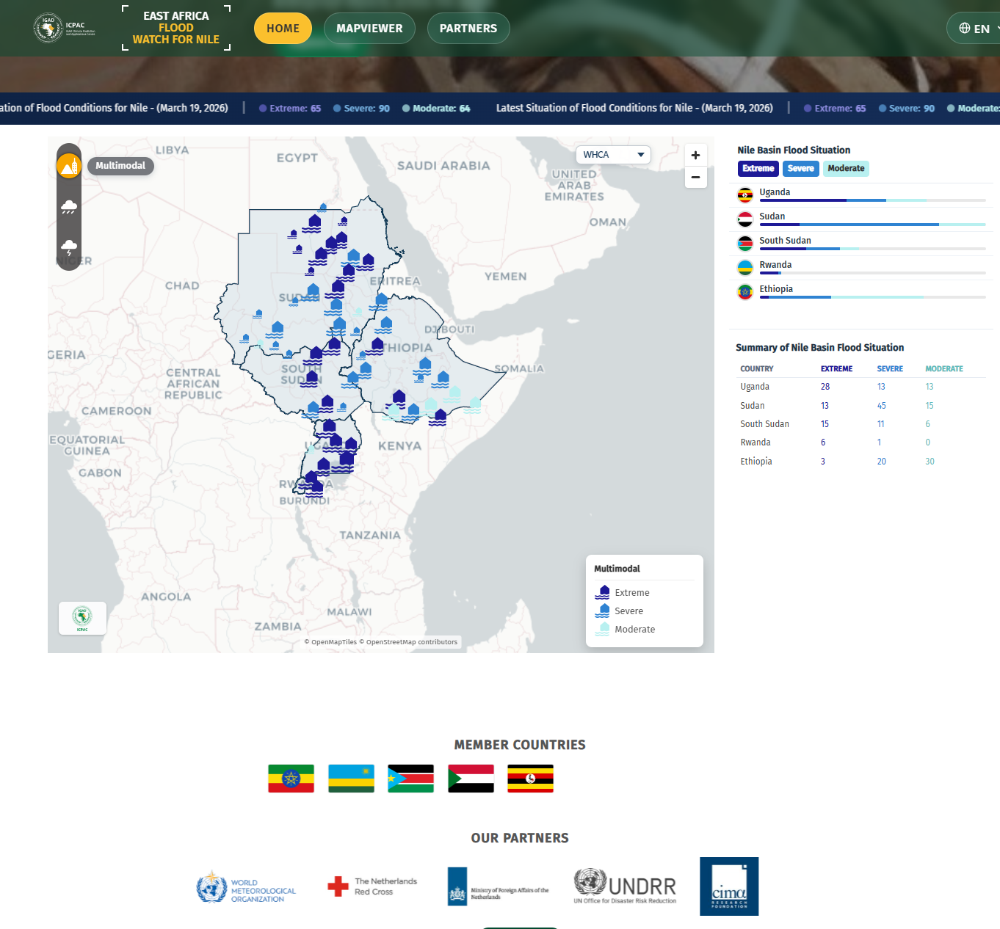
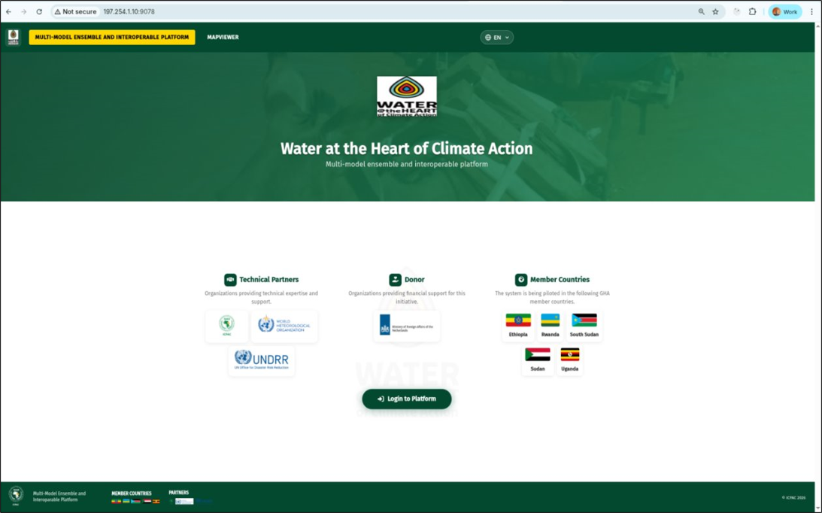
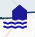
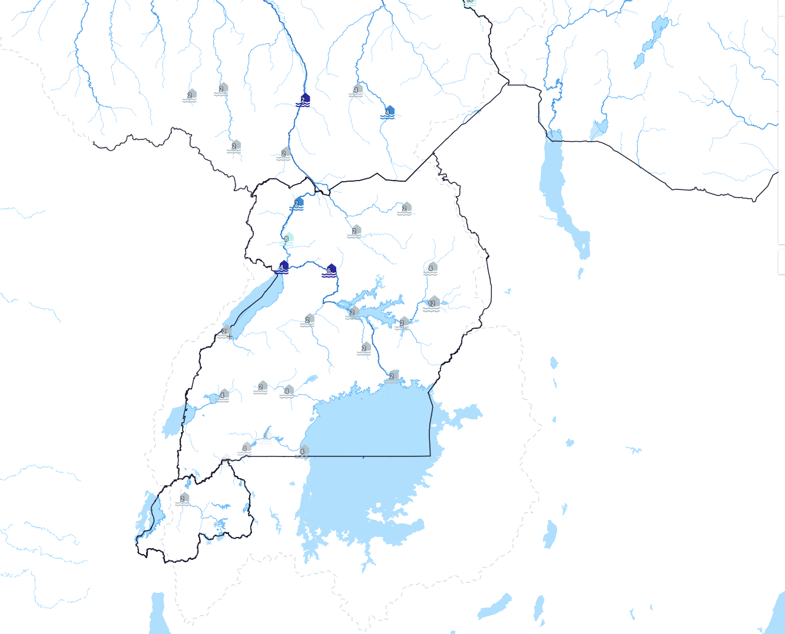
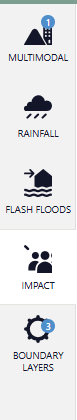
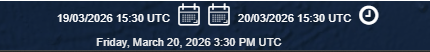
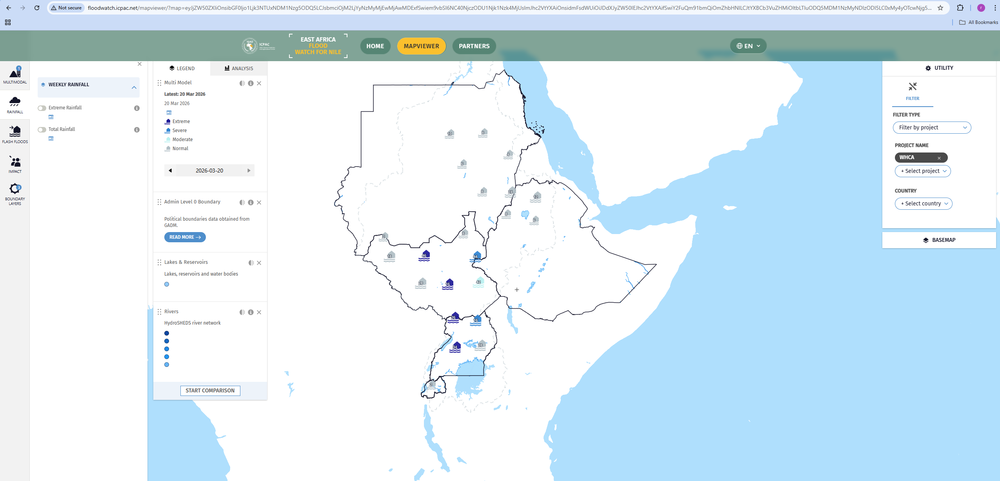

# FloodWatch Platform Feedback — WHCA / WMO

**Source:** Rishi Tripathi (WMO) — rtripathi@wmo.int
**Date:** March 2026

---

## 1. Homepage & Footer Updates

### Add SMHI as Technical Partner

Add the **SMHI logo** under the Technical Partners / "Our Partners" section on the homepage.

### Contact Information

Add to footer or contact section:
> For any issues or additional information: contact ICPAC email address or rtripathi@wmo.int

### WHCA Project Description

Add the following project context (e.g. in footer or About section):

> **Water at the Heart of Climate Action (WHCA)**
>
> The WHCA project is strengthening water action to mitigate the impacts of water-related risks and increase the climate resilience of affected communities. The project is implemented under the overall Early Warning For All (EW4All) initiative to ensure everyone on this planet is protected by the early warning system.
>
> More information: https://www.waterattheheartofclimateaction.org/

---

## 2. Map Icons — Differentiate Station Types

Currently all points use the same icon. The proposal is to differentiate:

1. **Actual stations** (with observed data) → Show with a **station icon** 
2. **Forecasting points** (dummy flood plain locations) → Show as **round points** (circles)

This helps users distinguish between real station locations and modeled flood plain points.

---

## 3. Sidebar Panel Reorganization

The sidebar (black circle area in screenshot) should be reorganized into two tabs:

### Proposed Structure

**Observations Tab:**
- Rainfall — Real-time data from AWS (country-level) or near-real-time global products (NOAA/NASA)
- Water levels — Observations from stations

**Forecasts Tab:**
- Multi-model forecast products (current "Multimodal" content)

---

## 4. Date/Time Selector Bar

Add a **Start Time** and **End Time** selector bar (red circle area in screenshot), visible in the map toolbar.

The selector should allow users to pick a time range for viewing forecasts and observations.

---

## 5. Show All Forecasting Points at All Zoom Levels

Currently, only a few forecasting points are shown at lower zoom levels; others only appear when zooming in.

**Request:** Show **all forecasting points** — both stations and dummy flood plain points — at all zoom levels. This gives users the full picture without needing to zoom in.

---

## 6. Hazard Layers

- Add a **Hazards** icon in the layer panel
- Show **hazard maps for different return periods** as static layers:
  - 25-year flood extent
  - 100-year flood extent
  - (Other return periods as available)

These are already in the system as raster tile layers (`flood_extent_rp25`, `flood_extent_rp100`) served via MapCache.
