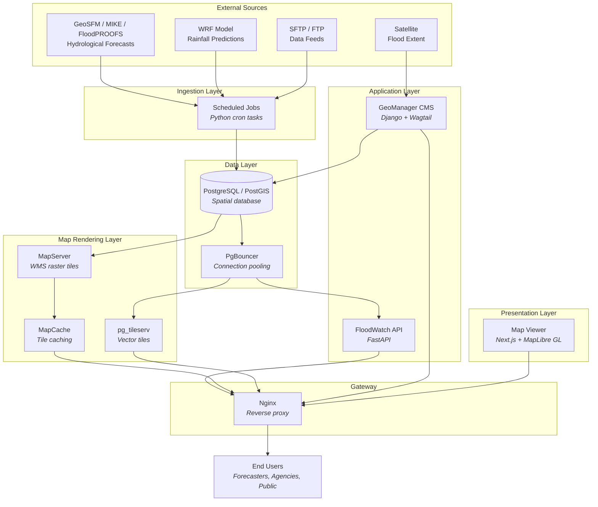
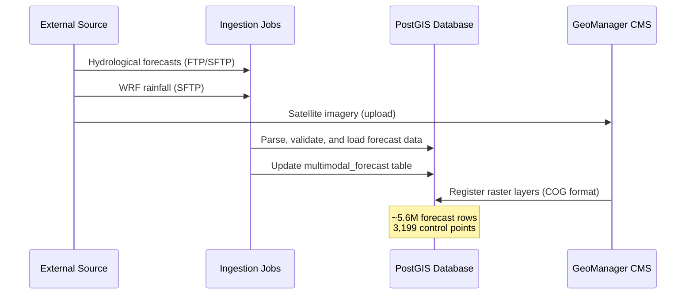
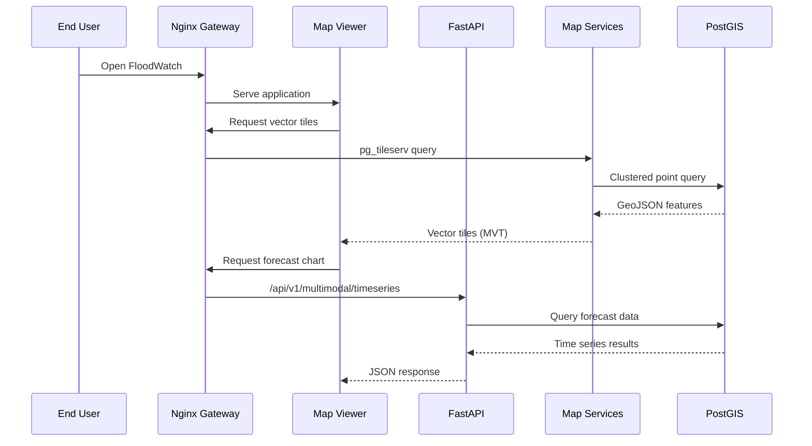
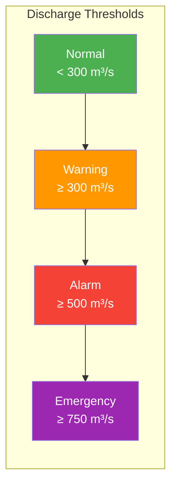

# System Architecture

## Design Principles

FloodWatch follows a **microservices architecture** where each component is independently deployable, scalable, and maintainable. The system is fully containerized using Docker Compose, enabling consistent deployment across development, staging, and production environments.

**Core design decisions:**

- **Separation of concerns** — Data ingestion, storage, API, rendering, and presentation are independent services
- **OGC compliance** — Map services follow Open Geospatial Consortium standards (WMS, WCS, vector tiles)
- **Spatial-first** — PostGIS powers all geospatial queries, with server-side clustering for performance at scale
- **Real-time capable** — Automated ingestion pipelines keep forecast data current with minimal latency

## High-Level Architecture

## Data Flow

### 1. Ingestion Pipeline

External data sources deliver forecast and observation data via scheduled transfers:

### 2. Request Flow

When a user interacts with the map viewer:

## Component Overview

### Frontend — Map Viewer
The web interface built with **Next.js** and **MapLibre GL JS**. Renders an interactive map with vector tiles (control points with clustering), raster overlays (flood extents, rainfall), and analytical widgets (time series charts, impact summaries).

### API — FastAPI Service
High-performance REST API serving flood data as JSON and GeoJSON. Provides endpoints for regional summaries, time series forecasts, alert statistics, risk assessments, and expert impact assessments. Auto-generates OpenAPI documentation.

### CMS — GeoManager
**[GeoManager](../geomanager/index.md)** is a Wagtail-based Django application for geospatial data management. Administrators use it to configure map layers, manage raster/vector datasets, set up automated data watchers, and style layer visualizations.

### Map Services
Three specialized services handle different tile formats:

- **MapServer** — Renders raster data (flood extents, rainfall grids) as WMS tiles
- **MapCache** — Caches rendered tiles for performance
- **pg_tileserv** — Serves vector tiles directly from PostGIS with server-side clustering

### Database — PostgreSQL/PostGIS
Central data store with two primary schemas:

- **`gha`** — Spatial operational data (control points, forecasts, admin boundaries)
- **`cms`** — Application data (CMS pages, layer configurations, user data)

### Ingestion — Scheduled Jobs
Python-based cron jobs that synchronize data from external sources:

- GeoSFM, MIKE, FloodPROOFS discharge forecasts
- WRF weather model rainfall predictions
- Google Flood Forecasts
- Satellite-derived flood extent observations

## Alert Classification

The system uses a three-tier alert classification based on river discharge thresholds:

These thresholds are applied consistently across the API, map visualization, and alerting systems.
