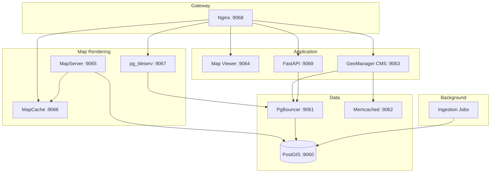
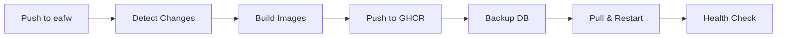

# Services & Infrastructure

11 containerized services orchestrated with Docker Compose

---

## Running Services

FloodWatch runs **11 containers** in production:

| Container | Image | Ports | Purpose |
|-----------|-------|:---:|---------|
| `eafw-pgdb` | `postgis/postgis:16-3.4` | 9060:5432 | PostgreSQL + PostGIS database |
| `eafw-pgbouncer` | `edoburu/pgbouncer:v1.23.1-p3` | 9061:6432 | Connection pooling |
| `eafw-memcached` | `memcached:1.6-alpine` | 9062:11211 | Session and query caching |
| `eafw-cms` | `ghcr.io/icpac-igad/eafw-cms` | 9063:8000 | GeoManager CMS (Django + Wagtail) |
| `eafw-mapviewer` | `ghcr.io/icpac-igad/eafw-mapviewer` | 9064:3000 | Map Viewer (Next.js 15) |
| `eafw-mapserver` | `ghcr.io/icpac-igad/eafw-mapserver` | 9065:80 | WMS raster tile rendering |
| `eafw-mapcache` | `ghcr.io/icpac-igad/eafw-mapcache` | 9066:80 | Tile caching layer |
| `eafw-tileserv` | `pramsey/pg_tileserv:latest` | 9067:7800 | Vector tiles from PostGIS |
| `eafw-nginx` | `nginx:1.27-alpine` | 9068:80 | Reverse proxy / gateway |
| `eafw-api` | `ghcr.io/icpac-igad/eafw-api` | 9069:9060 | FastAPI REST service |
| `eafw-jobs` | `ghcr.io/icpac-igad/eafw-jobs` | — | Scheduled data ingestion |

!!! info "Naming Convention"
    Docker Compose service names use **underscores** (`eafw_mapviewer`), container names use **dashes** (`eafw-mapviewer`).

## Service Topology

## Routing

All traffic enters through Nginx on port `9068`:

| Route | Service | Description |
|-------|---------|-------------|
| `/` | Map Viewer | Interactive flood map |
| `/api/` | FastAPI | REST API endpoints |
| `/api/docs` | FastAPI | Swagger UI |
| `/cms-admin/` | CMS | Wagtail admin panel |
| `/mapserver/` | MapServer | OGC WMS/WCS services |
| `/mapcache/` | MapCache | Cached tiles |
| `/pg/tileserv/` | pg_tileserv | Vector tiles |

## Database

### Schemas

| Schema | Purpose | Key Tables |
|--------|---------|------------|
| **`gha`** | Spatial data | `multimodal_control_points` (3,199 points), `multimodal_forecast` (~5.6M rows), `admin0/1/2` |
| **`cms`** | Application data | Wagtail pages, GeoManager layers, dataset configs |

### Alert Thresholds

| Level | Threshold | Color |
|-------|-----------|-------|
| **Normal** | < 300 m³/s | :material-circle:{ style="color: #4CAF50" } Green |
| **Warning** | >= 300 m³/s | :material-circle:{ style="color: #FF9800" } Orange |
| **Alarm** | >= 500 m³/s | :material-circle:{ style="color: #f44336" } Red |
| **Emergency** | >= 750 m³/s | :material-circle:{ style="color: #9C27B0" } Purple |

## CI/CD Pipeline

1. **Change Detection** — Only rebuilds images for modified components
2. **Build & Push** — Docker images to GitHub Container Registry
3. **Backup** — Checksum-verified database backup before deploy
4. **Deploy** — Pull images, inject secrets, restart containers
5. **Health Check** — Verify all 11 services are running

See [Deployment Guide](../getting-started/deployment.md) for details.
