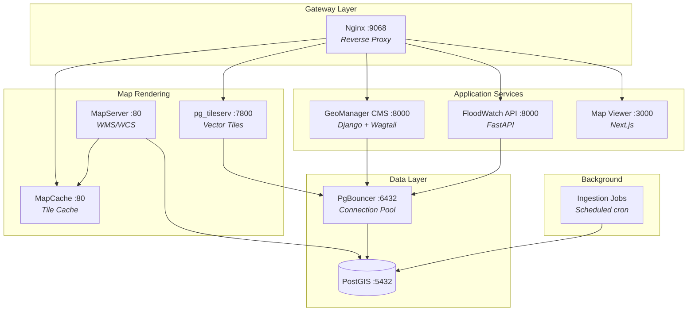
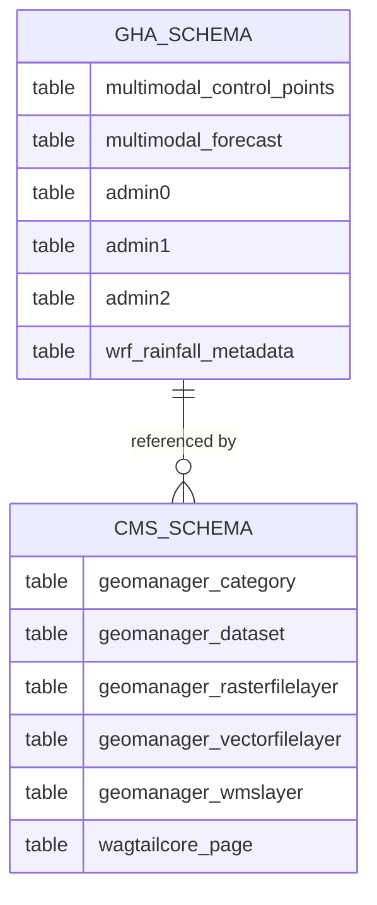
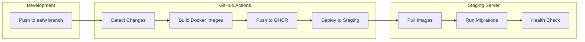

# Services & Infrastructure

<p style="font-size: 1.1em; color: #555;">
Containerized microservices orchestrated with Docker Compose
</p>

---

## Service Topology



## Routing

All external traffic enters through the **Nginx gateway** on port `9068`:

| Route | Service | Description |
|-------|---------|-------------|
| `/` | Map Viewer | Interactive flood map and analysis dashboard |
| `/api/` | FastAPI | REST API with Swagger documentation |
| `/api/docs` | FastAPI | Interactive Swagger UI |
| `/api/redoc` | FastAPI | ReDoc API documentation |
| `/cms-admin/` | GeoManager CMS | Wagtail admin interface |
| `/mapserver/` | MapServer | OGC WMS/WCS raster services |
| `/mapcache/` | MapCache | Cached tile endpoint |
| `/pg/tileserv/` | pg_tileserv | Vector tile endpoint |

## Service Reference

### Container Configuration

| Service | Container | Port (internal) | Port (external) | Technology |
|---------|-----------|-----------------|-----------------|------------|
| Database | `eafw-pgdb` | 5432 | 5432 | PostgreSQL 15 + PostGIS |
| Connection Pool | `eafw-pgbouncer` | 6432 | 6432 | PgBouncer |
| CMS | `eafw-cms` | 8000 | — | Django 4.2 + Wagtail 6.3 |
| API | `eafw-api` | 8000 | 9069 | FastAPI + Uvicorn |
| Map Viewer | `eafw-mapviewer` | 3000 | — | Next.js 15 |
| MapServer | `eafw-mapserver` | 80 | 9065 | MapServer 8 |
| MapCache | `eafw-mapcache` | 80 | 9066 | MapCache |
| Tile Server | `eafw-tileserv` | 7800 | 9067 | pg_tileserv |
| Gateway | `eafw-nginx` | 80 | 9068 | Nginx |
| Jobs | `eafw-jobs` | — | — | Python (cron) |

!!! info "Naming Convention"
    Docker Compose service names use **underscores** (`eafw_mapviewer`), while container names use **dashes** (`eafw-mapviewer`).

## Database Architecture

### Schema Design



| Schema | Purpose | Key Tables |
|--------|---------|------------|
| **`gha`** | Spatial operational data | `multimodal_control_points` (3,199 points), `multimodal_forecast` (~5.6M rows), `admin0/1/2` boundaries |
| **`cms`** | Application and CMS data | Wagtail pages, GeoManager layers, dataset configurations, user data |

### Alert Thresholds

The system classifies flood risk using three discharge thresholds, consistent across all services:

| Level | Threshold | Color | Action |
|-------|-----------|-------|--------|
| **Normal** | < 300 m³/s | :material-circle:{ style="color: #4CAF50" } Green | No action required |
| **Warning** | >= 300 m³/s | :material-circle:{ style="color: #FF9800" } Orange | Monitor situation |
| **Alarm** | >= 500 m³/s | :material-circle:{ style="color: #f44336" } Red | Prepare response |
| **Emergency** | >= 750 m³/s | :material-circle:{ style="color: #9C27B0" } Purple | Immediate action |

## CI/CD Pipeline



The staging deployment pipeline:

1. **Change Detection** — Only builds images for services with modified source files
2. **Image Build** — Builds Docker images using GitHub Actions with build cache
3. **Registry Push** — Pushes images to GitHub Container Registry (`ghcr.io`)
4. **Server Deploy** — SSH into staging server, pull images, run migrations, health check
5. **Verification** — Automated health checks for all critical services

## Environment Configuration

### Compose Files

| File | Environment | Usage |
|------|-------------|-------|
| `docker-compose.yml` | Local development | Full stack with hot reload |
| `docker-compose.staging.yml` | Staging | Production-like with GHCR images |

### Required Environment Variables

```bash
# Database
CMS_DB_PASSWORD=<strong-password>
SECRET_KEY=<django-secret-key>

# Data Source Credentials
FLOODPROOFS_SFTP_HOST=<host>
FLOODPROOFS_SFTP_PASSWORD=<password>
ENSEMBLE_FTP_HOST=<host>
ENSEMBLE_FTP_PASSWORD=<password>
WRF_FTP_HOST=<host>
WRF_FTP_PASSWORD=<password>
```

!!! warning "Security"
    Never commit `.env` files with real credentials. Use GitHub Secrets for CI/CD and environment-specific `.env` files for local development.
