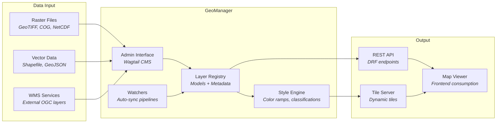
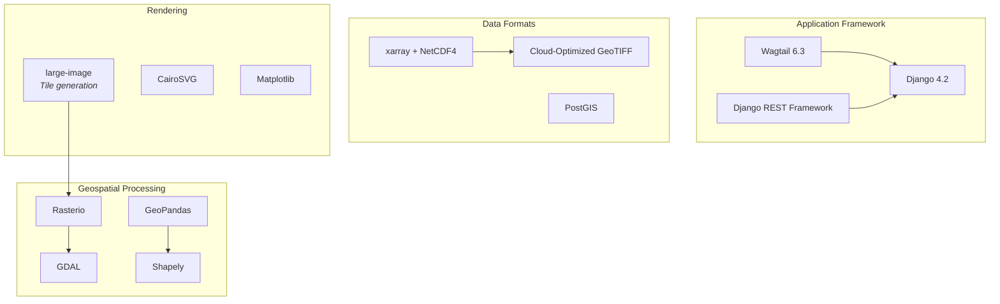

# GeoManager

<p style="font-size: 1.1em; color: #555;">
Open-source geospatial data management for Wagtail CMS
</p>

---

## Overview

GeoManager is a comprehensive **Wagtail-based Django package** for managing, serving, and visualizing geospatial data. It provides a full admin interface for raster, vector, WMS, and tile layers — purpose-built for environmental monitoring platforms like FloodWatch.

| | |
|---|---|
| **Version** | 0.7.2 (Beta) |
| **License** | GPL-3.0 |
| **Python** | >= 3.11 |
| **Framework** | Django 4.2 + Wagtail 6.3 |
| **Maintainer** | Hillary Koros ([hkoros@icpac.net](mailto:hkoros@icpac.net)) |

## How It Works



## Core Features

### :material-image-area: Raster Layer Management
Upload and manage GeoTIFF, COG, and NetCDF raster datasets. Automatic Cloud-Optimized GeoTIFF (COG) conversion. Configure time-series raster layers with temporal metadata for animated overlays.

### :material-vector-polygon: Vector Layer Management
Import shapefiles and GeoJSON into PostGIS. Manage vector tile layers with configurable styling. Support for both file-based and database-backed vector layers.

### :material-web: WMS Integration
Connect to external WMS services with automated dataset synchronization. Configure request layers, sync schedules, and fallback behavior for third-party OGC services.

### :material-palette: Layer Styling
Visual style editor with color ramps, value classifications, and opacity controls. Define custom color scales for raster data with named breakpoints. Preview styles directly in the admin interface.

### :material-robot: Automated Watchers
Configure directory watchers that automatically detect and ingest new data files. Set up periodic sync tasks for external data sources. Supports FTP, SFTP, and local filesystem monitoring.

### :material-translate: Multi-Language Support
Full internationalization with translations in 6 languages:

| Language | Code |
|----------|------|
| English | `en` |
| French | `fr` |
| Arabic | `ar` |
| Amharic | `am` |
| Swahili | `sw` |
| Spanish | `es` |

## Installation

### From GitHub

```bash
pip install git+https://github.com/icpac-igad/flood_watch_system.git#subdirectory=eafw_cms/geomanager
```

### From Release

```bash
pip install git+https://github.com/icpac-igad/flood_watch_system.git@geomanager-v0.7.2#subdirectory=eafw_cms/geomanager
```

### Add to Django Settings

```python
INSTALLED_APPS = [
    # ...
    "geomanager",
    "wagtail",
    "rest_framework",
    # ...
]
```

### Run Migrations

```bash
python manage.py migrate
python manage.py initialize_geomanager
```

## Technology Stack



## Management Commands

| Command | Description |
|---------|-------------|
| `initialize_geomanager` | Create default categories, settings, and initial configuration |
| `ingest_geomanager_raster` | Ingest raster data files into the layer registry |
| `process_geomanager_layer_directory` | Batch process a directory of layer files |
| `trigger_watchers` | Manually trigger all configured data watchers |

## Learn More

- [Release Process & Downloads](releases.md) — How to install specific versions and publish new releases
- [API Reference](../api/swagger.md) — Interactive API documentation
- [Source Code](https://github.com/icpac-igad/flood_watch_system/tree/main/eafw_cms/geomanager) — Browse on GitHub
