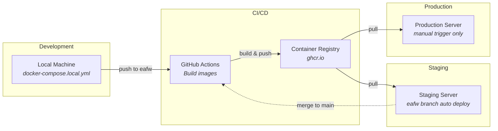
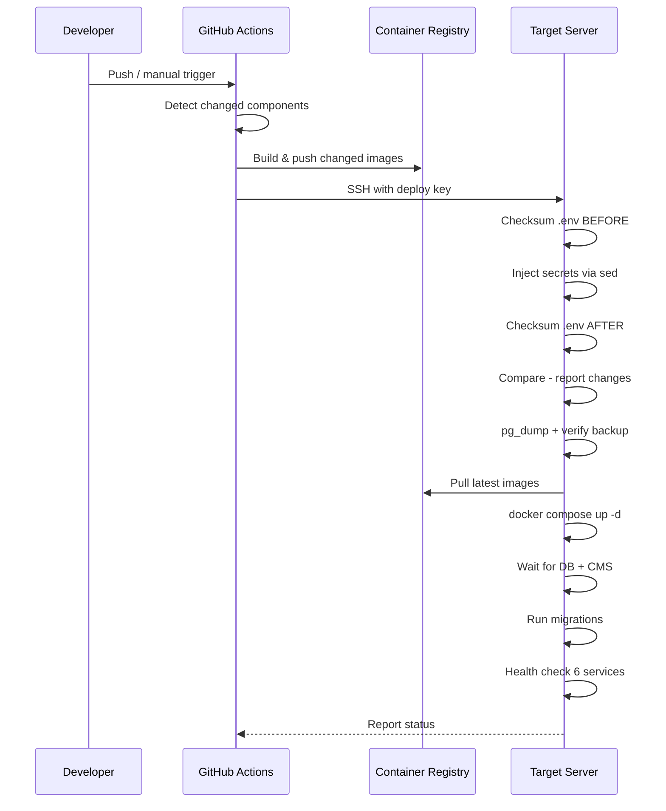

# Deployment Overview

<p style="font-size: 1.1em; color: #555;">
How FloodWatch moves from code to running services across environments
</p>

---

## Deployment Environments



| Environment | Branch | Trigger | Backup | Secrets Source |
|------------|--------|---------|--------|----------------|
| **Local** | any | manual | none | `.env` file |
| **Staging** | `eafw` | auto on push | checksum-verified, keep 5 | GitHub Environment (`staging`) |
| **Production** | `main` | manual only | checksum + integrity check, keep 10 | GitHub Environment (`production`) |

---

## Staging vs Production

| Feature | Staging | Production |
|---------|---------|------------|
| **Trigger** | Auto on push to `eafw` | Manual `workflow_dispatch` only |
| **Backup on failure** | Warn and continue | Abort deployment |
| **Backup verification** | SHA-256 checksum | SHA-256 + `pg_restore --list` integrity |
| **Backup retention** | Last 5 | Last 10 |
| **DB crash recovery** | Auto-reset pgdata volume | Abort (manual intervention required) |
| **Skip backup option** | No | Yes (with `skip_backup` flag) |

---

## Shared Pipeline

Both staging and production follow the same core steps:



### Change Detection

Only changed components trigger image rebuilds:

| Component | Trigger Paths | Image |
|-----------|--------------|-------|
| API | `eafw_api/` | `eafw-api` |
| CMS | `eafw_cms/`, `eafw_docker/cms/` | `eafw-cms` |
| Mapviewer | `eafw_mapviewer/`, `eafw_docker/mapviewer/` | `eafw-mapviewer` |
| Mapserver | `eafw_docker/mapserver/` | `eafw-mapserver` |
| Mapcache | `eafw_docker/mapcache/` | `eafw-mapcache` |
| Jobs | `eafw_jobs/`, `eafw_docker/jobs/` | `eafw-jobs` |

---

## Quick Reference

```bash
# Deploy to staging (automatic)
git push origin eafw

# Deploy to production (manual)
gh workflow run "Build & Deploy to Production"

# Force rebuild all images
gh workflow run "Build & Deploy to Staging" -f force_build=true

# Check recent deploys
gh run list --workflow="Build & Deploy to Staging" --limit 5
gh run list --workflow="Build & Deploy to Production" --limit 5

# View deploy logs
gh run view <run-id> --log
```

---

## Detailed Guides

- **[Staging Deployment](staging-deployment.md)** — Full pipeline details, backup verification, troubleshooting
- **[Secrets Management](secrets-management.md)** — How credentials flow across environments
