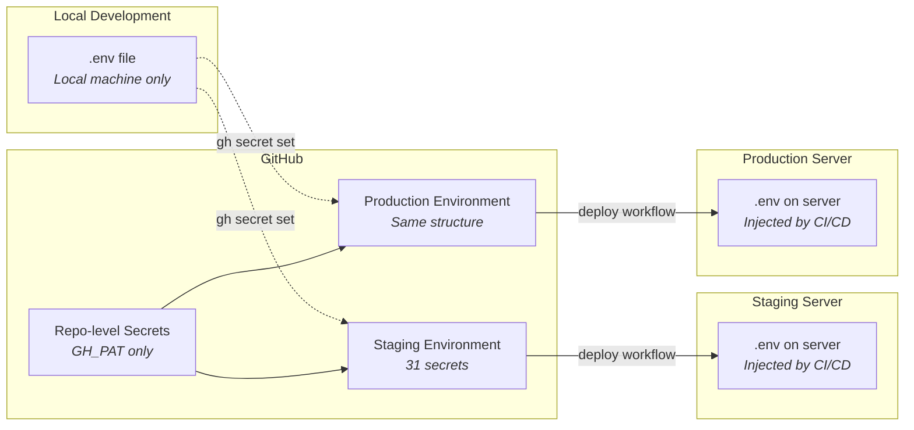
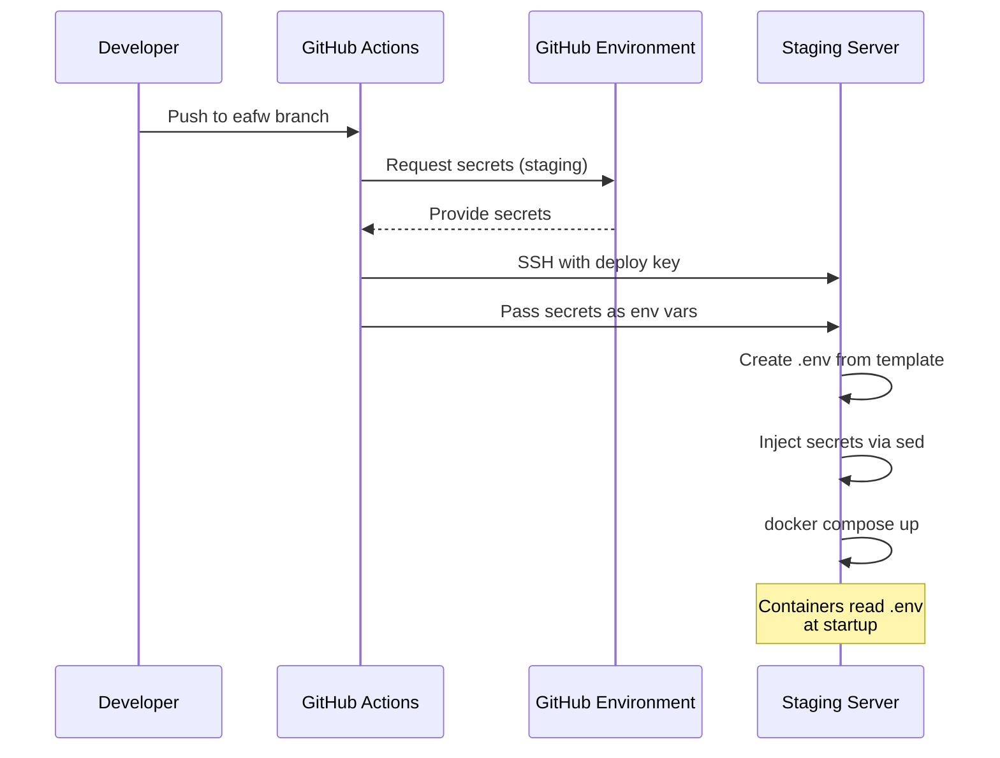

# Secrets Management

<p style="font-size: 1.1em; color: #555;">
How credentials flow from development to staging and production
</p>

---

## Overview

FloodWatch uses **GitHub Environments** to manage secrets across deployment targets. Each environment (staging, production) has its own isolated set of secrets that are injected during CI/CD deployment.



## Secret Categories

### Database & Application

| Secret | Description | Used By |
|--------|-------------|---------|
| `DB_PASSWORD` | PostgreSQL password | CMS, API |
| `DB_USER` | PostgreSQL username | CMS, API |
| `DJANGO_SECRET_KEY` | Django cryptographic key | CMS |

### Data Source Credentials

| Secret | Description | Used By |
|--------|-------------|---------|
| `SFTP_HOST` | Legacy SFTP server | Jobs |
| `SFTP_USERNAME` | Legacy SFTP user | Jobs |
| `SFTP_PASSWORD` | Legacy SFTP password | Jobs |
| `FLOODPROOFS_SFTP_HOST` | FloodPROOFS SFTP server | Jobs |
| `FLOODPROOFS_SFTP_USER` | FloodPROOFS SFTP user | Jobs |
| `FLOODPROOFS_SFTP_PASSWORD` | FloodPROOFS SFTP password | Jobs |
| `ENSEMBLE_FTP_HOST` | Ensemble FTP server | Jobs |
| `ENSEMBLE_FTP_USER` | Ensemble FTP user | Jobs |
| `ENSEMBLE_FTP_PASSWORD` | Ensemble FTP password | Jobs |
| `WRF_FTP_HOST` | WRF model FTP server | Jobs |
| `WRF_FTP_USER` | WRF model FTP user | Jobs |
| `WRF_FTP_PASSWORD` | WRF model FTP password | Jobs |

### External APIs

| Secret | Description | Used By |
|--------|-------------|---------|
| `FLOODS_API_KEY` | Google Flood API key | Jobs |
| `GOOGLE_SEARCH_API_KEY` | Google Search API | CMS |
| `RECAPTCHA_PUBLIC_KEY` | reCAPTCHA public key | CMS |
| `RECAPTCHA_PRIVATE_KEY` | reCAPTCHA private key | CMS |
| `DRIVE_FOLDER_ID` | Google Drive folder | Jobs |

### Email / SMTP

| Secret | Description | Used By |
|--------|-------------|---------|
| `SMTP_EMAIL_HOST` | SMTP server hostname | CMS |
| `SMTP_EMAIL_HOST_USER` | SMTP username | CMS |
| `SMTP_EMAIL_HOST_PASSWORD` | SMTP password | CMS |

### Deployment

| Secret | Description | Used By |
|--------|-------------|---------|
| `DEPLOY_HOST` | Server IP/hostname | CI/CD |
| `DEPLOY_USER` | SSH username | CI/CD |
| `SSH_KEY` | SSH private key | CI/CD |
| `GH_PAT` | GitHub token (repo-level) | CI/CD, GHCR |

## How to Manage Secrets

### View Current Secrets

```bash
# List repo-level secrets
gh secret list

# List environment secrets
gh secret list --env staging
gh secret list --env production
```

### Add or Update a Secret

```bash
# From your local .env file
gh secret set SECRET_NAME --env staging --body "secret-value"

# Interactive (prompts for value)
gh secret set SECRET_NAME --env staging

# Bulk import from .env file
grep '^VARIABLE_NAME=' .env | cut -d= -f2- | gh secret set VARIABLE_NAME --env staging --body -
```

### Copy All Secrets from .env to an Environment

```bash
# One-liner to push a specific secret from .env
gh secret set DB_PASSWORD --env staging \
  --body "$(grep '^CMS_DB_PASSWORD=' .env | cut -d= -f2-)"

# Push all FTP secrets at once
for var in ENSEMBLE_FTP_HOST ENSEMBLE_FTP_USER ENSEMBLE_FTP_PASSWORD; do
  gh secret set "$var" --env staging \
    --body "$(grep "^${var}=" .env | cut -d= -f2-)"
done
```

### Set Up a New Environment (e.g., Production)

```bash
# 1. Create the environment
gh api repos/icpac-igad/flood_watch_system/environments/production -X PUT

# 2. Copy all secrets from staging (you'll need the values from .env)
for secret in DB_PASSWORD DB_USER DJANGO_SECRET_KEY \
  SFTP_HOST SFTP_USERNAME SFTP_PASSWORD \
  FLOODPROOFS_SFTP_HOST FLOODPROOFS_SFTP_USER FLOODPROOFS_SFTP_PASSWORD \
  ENSEMBLE_FTP_HOST ENSEMBLE_FTP_USER ENSEMBLE_FTP_PASSWORD \
  WRF_FTP_HOST WRF_FTP_USER WRF_FTP_PASSWORD \
  FLOODS_API_KEY SMTP_EMAIL_HOST SMTP_EMAIL_HOST_USER SMTP_EMAIL_HOST_PASSWORD \
  DEPLOY_HOST DEPLOY_USER SSH_KEY; do
  echo "Set $secret for production:"
  gh secret set "$secret" --env production
done
```

### Delete a Secret

```bash
gh secret delete SECRET_NAME --env staging
```

## How Secrets Flow During Deployment



## Security Best Practices

!!! warning "Critical Rules"
    1. **Never commit `.env` files** — They are gitignored for a reason
    2. **Rotate secrets regularly** — Especially after team member changes
    3. **Use environment-specific values** — Different passwords for staging vs production
    4. **Minimum privilege** — Each service only gets the secrets it needs
    5. **Audit access** — Check GitHub audit log for secret access

!!! tip "Local Development"
    For local development, copy the example file and fill in values:
    ```bash
    cp staging.env.example .env
    # Edit .env with your local credentials
    ```
    Your `.env` file is gitignored and will never be committed.
