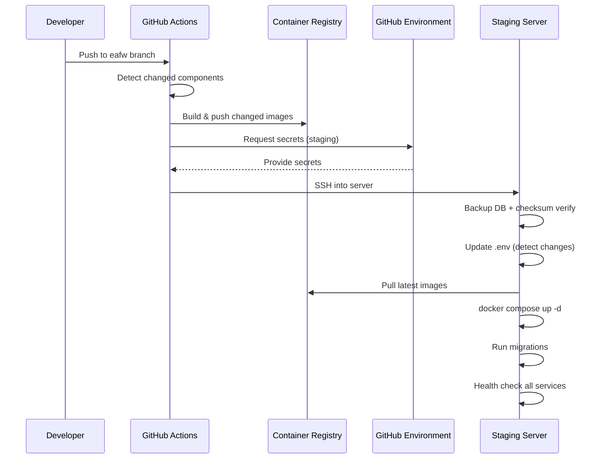
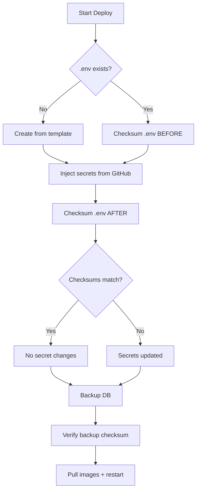

# Staging Deployment

<p style="font-size: 1.1em; color: #555;">
Automated CI/CD pipeline from code push to running containers
</p>

---

## How It Works

FloodWatch staging deploys automatically when you push to the `eafw` branch. The pipeline builds changed Docker images, backs up the database with checksum verification, injects secrets, and restarts containers.



## Deployment Pipeline

### 1. Change Detection

Only changed components are rebuilt, saving time and bandwidth:

| Component | Trigger Paths | Image |
|-----------|--------------|-------|
| API | `eafw_api/` | `eafw-api` |
| CMS | `eafw_cms/`, `eafw_docker/cms/` | `eafw-cms` |
| Mapviewer | `eafw_mapviewer/`, `eafw_docker/mapviewer/` | `eafw-mapviewer` |
| Mapserver | `eafw_docker/mapserver/` | `eafw-mapserver` |
| Mapcache | `eafw_docker/mapcache/` | `eafw-mapcache` |
| Jobs | `eafw_jobs/`, `eafw_docker/jobs/` | `eafw-jobs` |

### 2. Checksum-Based Backup

Before any deployment changes, the pipeline:

1. **Snapshots current `.env`** — computes SHA-256 checksum before secret injection
2. **Injects secrets** from GitHub Environment into `.env`
3. **Compares checksums** — reports whether secrets changed or stayed the same
4. **Backs up the database** with `pg_dump` (custom format)
5. **Saves checksum file** alongside each backup for later verification
6. **Retains last 5 backups** — older ones are automatically cleaned up



### 3. Secret Injection

Secrets flow from GitHub Environment into the server's `.env` file via `sed` replacement:

```
GitHub Environment (staging)
    ├── DB_PASSWORD        → CMS_DB_PASSWORD=...
    ├── DJANGO_SECRET_KEY  → SECRET_KEY=...
    ├── SFTP_HOST          → SFTP_HOST=...
    ├── SFTP_USERNAME      → SFTP_USERNAME=...
    ├── SFTP_PASSWORD      → SFTP_PASSWORD=...
    ├── FLOODPROOFS_*      → FLOODPROOFS_SFTP_*=...
    ├── ENSEMBLE_FTP_*     → ENSEMBLE_FTP_*=...
    ├── WRF_FTP_*          → WRF_FTP_*=...
    ├── FLOODS_API_KEY     → FLOODS_API_KEY=...
    └── SMTP_*             → SMTP_EMAIL_*=...
```

### 4. Container Restart & Migrations

After pulling new images:

1. `docker compose up -d` — restarts changed containers
2. Wait for PostgreSQL readiness (up to 5 minutes)
3. Run SQL migrations (schema updates)
4. Wait for CMS readiness (up to 2.5 minutes)
5. Run Django migrations + collectstatic
6. Reload nginx configuration
7. Health check all 6 core services

---

## Triggering a Deploy

### Automatic (push to eafw)

```bash
git push origin eafw
```

### Manual (GitHub UI)

1. Go to **Actions** > **Build & Deploy to Staging**
2. Click **Run workflow**
3. Optionally check **Force rebuild all images**

### Force rebuild all images

```bash
# Via GitHub CLI
gh workflow run "Build & Deploy to Staging" -f force_build=true
```

---

## Verifying Backups

Backups are stored on the staging server at `~/eafw-backups/`:

```bash
# List backups with sizes
ls -lh ~/eafw-backups/staging_db_*.dump

# Verify checksum of a backup
sha256sum -c ~/eafw-backups/staging_db_20260215_120000.dump.sha256

# List contents of a backup (integrity check)
pg_restore --list ~/eafw-backups/staging_db_20260215_120000.dump | head -20

# Restore from backup (if needed)
docker exec -i eafw-pgdb pg_restore -U eafw_user -d eafw_db --clean < ~/eafw-backups/staging_db_20260215_120000.dump
```

---

## Server Prerequisites

### System Requirements

| Requirement | Minimum | Recommended |
|------------|---------|-------------|
| OS | Ubuntu 20.04+ / RHEL 8+ | Ubuntu 22.04 |
| RAM | 8 GB | 16 GB |
| Disk | 50 GB | 100 GB |
| Docker | 20.10+ | Latest |
| Docker Compose | v2.0+ | Latest |

### Required Static Data

Place in `backend/static_data/` on the server:

- `GHA_EA_admin0.geojson` — Country boundaries
- `GHA_EA_admin1.geojson` — Admin level 1
- `GHA_EA_admin2.geojson` — Admin level 2
- `Lakes.geojson` — Water bodies
- `HydroRIVERS_v10_GHA.geojson` — River network
- `ensemble_control_file.geojson` — 3,199 control points
- `fp_sections_igad.*` — Monitoring stations shapefile

---

## Monitoring

### Check Service Status

```bash
# All containers
docker ps --format "table {{.Names}}\t{{.Status}}\t{{.Ports}}"

# Resource usage
docker stats --no-stream

# Recent deploy logs
gh run list --workflow="Build & Deploy to Staging" --limit 5
```

### Check Data Availability

```bash
# API health
curl -sf https://floodwatch-staging.icpac.net/api/health

# Forecast dates
curl -sf https://floodwatch-staging.icpac.net/api/v1/multimodal/homepage-stats
```

---

## Troubleshooting

### Deploy Failed — DB Backup

If the database is in a crash-loop (`restarting` or `exited`), the staging workflow will:

1. Reset the pgdata volume
2. Re-initialize the database from scratch
3. Init scripts load ~60MB of spatial data

### Deploy Failed — CMS Not Ready

The CMS takes time to start on first deploy. If Django migrations are skipped, the entrypoint will run them automatically on next container restart.

### Secrets Not Updating

Check the deployment summary in GitHub Actions logs:

```
=========================================
  DEPLOYMENT SUMMARY
=========================================
  Secrets changed: true    ← should be true if you updated GitHub secrets
  Git SHA: abc1234
=========================================
```

If `Secrets changed: false` but you updated a secret, verify it was set in the correct environment:

```bash
gh secret list --env staging
```
