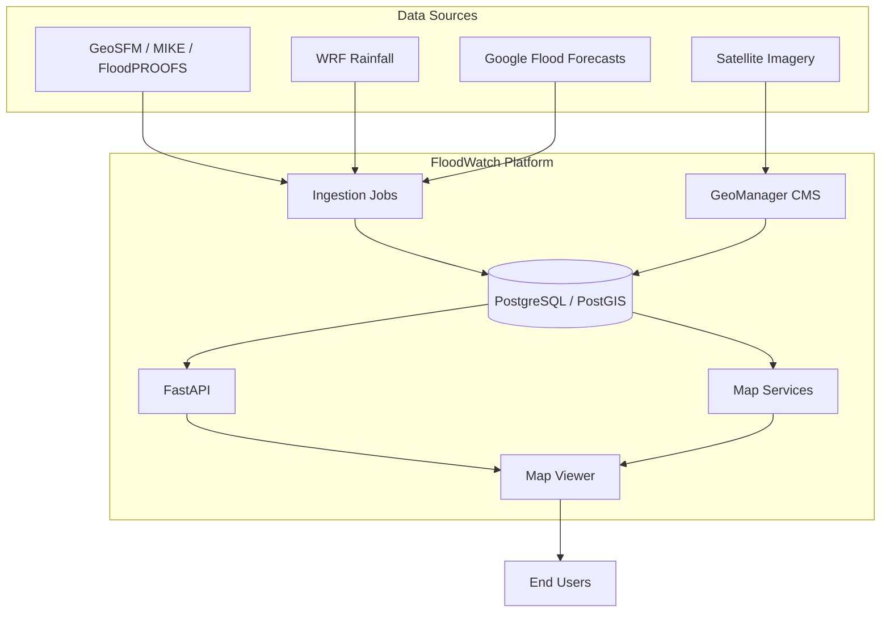

# FloodWatch System

An operational flood early warning platform for the Greater Horn of Africa

---

## What is FloodWatch?

FloodWatch is a real-time flood monitoring and early warning system developed by [ICPAC](https://www.icpac.net/) (IGAD Climate Prediction and Applications Centre). It monitors **3,199+ river control points** across **11 countries**, providing discharge forecasts, flood alerts, and impact assessments to support disaster preparedness.

## Forecast Models

FloodWatch integrates multiple hydrological and weather forecast models:

| Model | Type | Description |
|-------|------|-------------|
| **GeoSFM** | Hydrological | Satellite-driven streamflow model for Africa |
| **MIKE** | Hydrological | Danish Hydraulic Institute river basin model |
| **FloodPROOFS** | Hydrological | CIMA Foundation deterministic flood forecasting |
| **Google Flood Forecasts** | Hydrological | Google AI-based flood prediction |
| **HYPE** | Hydrological | Swedish SMHI large-scale hydrological model *(coming soon)* |
| **WRF** | Weather | High-resolution rainfall forecasts |

## Key Features

| Feature | Description |
|:--------|:------------|
| :material-map: **Real-Time Monitoring** | Interactive map with discharge forecasts and alert classification (Warning, Alarm, Emergency) |
| :material-chart-line: **Ensemble Forecasts** | 7-day ensemble discharge forecasts with uncertainty bands |
| :material-layers: **Satellite Flood Extent** | Flood extent mapping from satellite imagery with return period analysis |
| :material-alert: **CAP Alerts** | Common Alerting Protocol integration for national warning systems |
| :material-file-document: **Impact Assessment** | Expert-driven flood impact reports with population exposure estimates |
| :material-earth: **GeoManager CMS** | Open-source geospatial layer management (raster, vector, WMS, tiles) |

## Architecture

| Component | Technology | Purpose |
|-----------|-----------|---------|
| **Frontend** | Next.js, MapLibre GL | Map viewer and flood analysis dashboard |
| **API** | FastAPI | Forecast data, summaries, and alerts |
| **CMS** | Django, Wagtail, GeoManager | Layer management and content admin |
| **Map Services** | MapServer, MapCache, pg_tileserv | Raster and vector tile serving |
| **Database** | PostgreSQL, PostGIS | Spatial data storage |
| **Ingestion** | Scheduled Python jobs | Automated data sync from FTP/SFTP sources |

## Coverage

| | | |
|---|---|---|
| Burundi | Djibouti | Eritrea |
| Ethiopia | Kenya | Rwanda |
| Somalia | South Sudan | Sudan |
| Tanzania | Uganda | |

## Quick Links

- [Getting Started](getting-started/quickstart.md) — Local development setup
- [API Reference](api/swagger.md) — Interactive Swagger docs
- [Architecture](architecture/overview.md) — System design
- [Deployment](getting-started/deployment.md) — CI/CD pipeline

---

## Funding & Partners

    
Funded by

    
<strong>CrafD</strong> — Complex Risk Analytics Fund

    
Under the <strong>E4DRR project</strong> at ICPAC

The **WHCA (Water at Heart)** project covers Nile basin countries (Uganda, Rwanda, South Sudan, Ethiopia, Sudan), funded by the **Netherlands Red Cross** through the **Netherlands Ministry of Foreign Affairs**, channelled via **WMO** to **ICPAC** as the implementing agency.

| Partner | Role |
|---------|------|
| **[ICPAC](https://www.icpac.net/)** | Implementing agency — system development and operations |
| **[Netherlands Red Cross](https://www.rodekruis.nl/)** | WHCA funding via Netherlands Ministry of Foreign Affairs |
| **[WMO](https://wmo.int/)** | Programme coordination |
| **[UNDRR](https://www.undrr.org/)** | Disaster risk reduction framework |
| **[CIMA Foundation](https://www.cimafoundation.org/)** | FloodPROOFS hydrological model |
| **[SMHI](https://www.smhi.se/)** | HYPE hydrological model |

