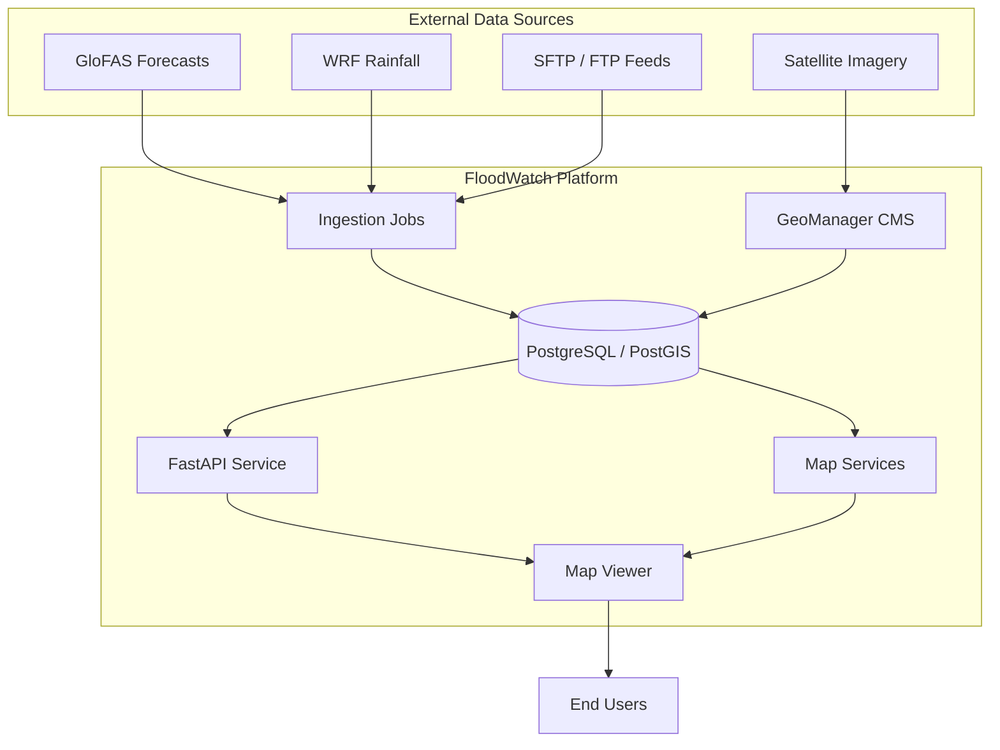

# FloodWatch System

An operational flood early warning platform for the Greater Horn of Africa

---

## What is FloodWatch?

FloodWatch is a real-time flood monitoring and early warning system developed by the [IGAD Climate Prediction and Applications Centre (ICPAC)](https://www.icpac.net/). It provides actionable intelligence to disaster management agencies, humanitarian organizations, and communities across **11 countries** in the Greater Horn of Africa.

The platform integrates hydrological forecast models, satellite-derived observations, weather prediction data, and community-reported impacts into a unified decision-support system.

## Key Capabilities

- :material-map: **Real-Time Flood Monitoring**

    Interactive map with 3,199+ river monitoring points, real-time discharge forecasts, and multi-threshold alert classification (Warning, Alarm, Emergency).

- :material-chart-line: **Forecast Analytics**

    7-day ensemble discharge forecasts with uncertainty bands, historical comparison, and return period analysis for flood risk assessment.

- :material-layers: **Multi-Source Data Fusion**

    Combines GloFAS hydrological models, WRF weather predictions, satellite flood extent mapping, and ground-based observations.

- :material-alert: **Automated Alerting**

    Threshold-based alert generation with three severity levels. Supports CAP (Common Alerting Protocol) for interoperability with national warning systems.

- :material-file-document: **Impact Assessment**

    Expert-driven flood impact assessments with population exposure estimates, infrastructure damage reports, and situational analysis.

- :material-earth: **Geospatial Data Management**

    Powered by GeoManager, an open-source Wagtail-based package for managing raster, vector, WMS, and tile layers with full admin interface.

## Platform Architecture

FloodWatch is built as a modern, containerized microservices stack:

| Layer | Technology | Purpose |
|-------|-----------|---------|
| **Frontend** | Next.js, MapLibre GL | Interactive map viewer and flood analysis dashboard |
| **API** | FastAPI | RESTful endpoints for forecasts, summaries, and risk data |
| **CMS** | Django, Wagtail, GeoManager | Content management and geospatial layer administration |
| **Map Services** | MapServer, MapCache, pg_tileserv | OGC-compliant raster and vector tile serving |
| **Database** | PostgreSQL, PostGIS | Spatial data storage with advanced geospatial queries |
| **Ingestion** | Scheduled Python jobs | Automated data sync from FTP, SFTP, and cloud sources |

## Coverage

FloodWatch covers the **Greater Horn of Africa** region:

| | | |
|---|---|---|
| Burundi | Djibouti | Eritrea |
| Ethiopia | Kenya | Rwanda |
| Somalia | South Sudan | Sudan |
| Tanzania | Uganda | |

## Quick Links

- [Getting Started](getting-started/quickstart.md) — Set up a local development environment
- [API Reference](api/swagger.md) — Interactive Swagger documentation
- [Architecture](architecture/overview.md) — System design and data flow
- [GeoManager](geomanager/index.md) — Geospatial data management package

---

Built with dedication by <strong>Hillary Koros</strong> at <a href="https://www.icpac.net/">ICPAC</a> — IGAD Climate Prediction and Applications Centre

